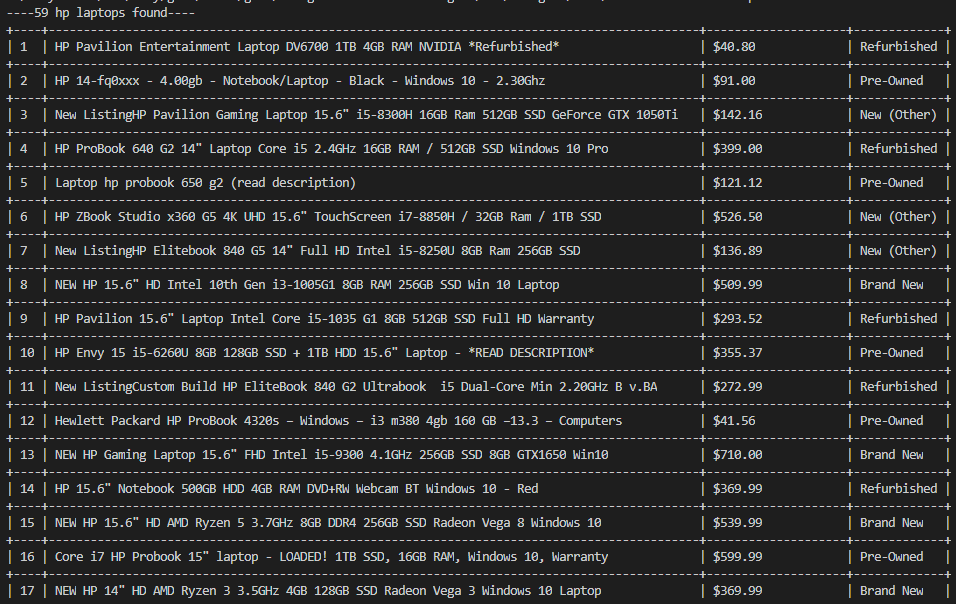
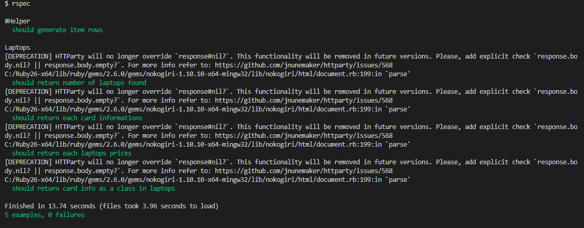

# web-scraper

> This program's purpose is to scan a webpage and take relevant data from it that could benefit the user. This is to help anybody who wants to know about various hp laptops available for sales with their prices and conditions on ebay.com.

## Screenshot

In this project, information about available hp laptops for sales on ebay.com is provided.

## Built With

- Ruby
- Nokogiri
- httparty
- Rubocop

## App work flow
- The app shows the total number of all available hp laptops on ebay.com.
- The app shows all data of hp laptops in a table.
- The app can be tested using rspec.

### Prerequisites
To get this project up and running locally, you must already have little experience working with Ruby and have it installed
### Setup
Step 1: Clone the repository

'git clone https://github.com/Adewunmi97/web_scraper.git'

Step 2: Move into the project directory

'cd web_scraper'

Step 3: Install necessary dependencies

'bundle install'

Step 4: Move to the bin directory

'cd bin'

Step 5: Run the app

'ruby main.rb'

Step 6: Run the test

'rspec'

### Testing

Simply run rspec from the root directory

## Authors

👤 **Author1**

- GitHub: [@Adewunmi97](https://github.com/githubhandle)
- Twitter: [@ShonibareC](https://twitter.com/twitterhandle)

## 🤝 Contributing

Contributions, issues, and feature requests are welcome!

Feel free to check the [issues page](issues/).

## Show your support

Give a ⭐️ if you like this project!

## Acknowledgments

- Microverse

## 📝 License

This project is [MIT](lic.url) licensed.